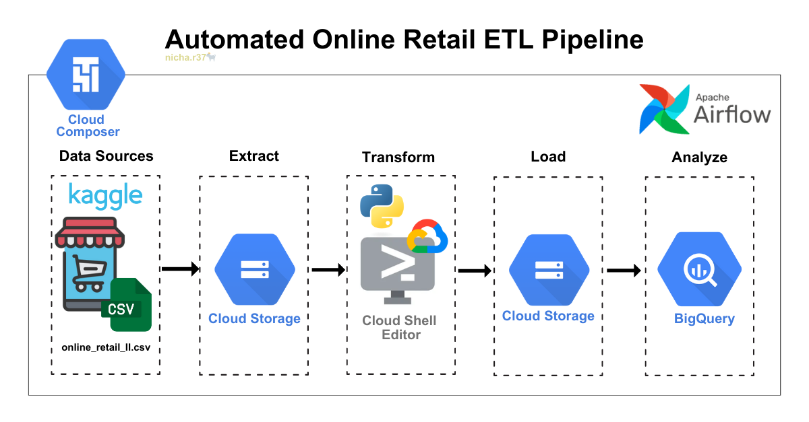

# ETL-Pipeline-for-Online-Retail-End-to-End-Project  
End-to-End ETL Pipeline using Apache Airflow & GCP: Cloud Composer, Google Cloud Storage, and BigQuery  

# Retail ETL & Data Validation Pipeline  

## 📌 Overview  
This project is an **end-to-end data engineering pipeline** built on **Google Cloud Platform (GCP)**.  
It processes raw retail sales data, ensures data quality, and loads clean datasets into **BigQuery** for analytics and business insights.  

---

## 🎯 Objectives  
- Automate the ETL pipeline (Extract → Transform → Load).  
- Apply **data validation checks** (duplicates, nulls, type consistency).  
- Support business intelligence use cases such as:  
  - Top customers by sales  
  - Best-selling products  
  - Monthly sales trends  

---

## 🎀 Pipeline Architechture  



---

## 📂 Dataset  

🔹 **Online Retail II (E-commerce Transactions)**  
- 📍 **Source**: [Kaggle - Online Retail II (UCI)](https://www.kaggle.com/datasets/mashlyn/online-retail-ii-uci)  
- **Description**: A transactional e-commerce dataset containing invoices, products, quantities, countries, and timestamps.  
- **Data Challenges**: Contains missing values and duplicate records that require cleaning.  

### 🛠 ETL Flow (Requirements)  
- **Extract** → Load raw CSV files into **Google Cloud Storage** (staging area).  
- **Transform** → Remove duplicate invoices, handle missing `Customer_ID`, and calculate derived fields (e.g., `Total Price`).  
- **Load** → Write the transformed dataset into **BigQuery** (`fact_sales` table).  
- **Analytics** → Run queries for:  
  - 📊 RFM segmentation  
  - 🏆 Top products per country  
  - 📈 Sales trends & customer insights  

---

## 🛠 Tech Stack  

- 🐍 **Python**: Core programming language for data processing and pipeline development.  
  - Libraries:  
    - 📊 **pandas** – Data manipulation & analysis  
    - 📦 **google-cloud-storage** – Integration with Google Cloud Storage  
    - 🔍 **google-cloud-bigquery** – Integration with BigQuery  

- 🌀 **Apache Airflow / Cloud Composer**: Workflow orchestration and scheduling to automate, monitor, and manage ETL pipelines.  

- ☁️ **Google Cloud Storage (GCS)**: Serves as a **data lake / staging area** for raw and processed data.  

- 🔎 **Google BigQuery**: A **fully managed, serverless data warehouse** for analytics, reporting, and BI.  

- 💡 **SQL**: For **data validation checks** (duplicates, nulls, negative values) and business intelligence queries.  

---

## ⚙️ Pipeline Workflow  

| Step | Task                     | Description                                                                                                                                                                                                       |
| ---- | ------------------------ | ----------------------------------------------------------------------------------------------------------------------------------------------------------------------------------------------------------------- |
| 1    | Load Data                | Download CSV from GCS and save as Parquet.                                                                                                                                                                        |
| 2    | Drop Duplicates          | Remove duplicate rows by `Invoice + StockCode + InvoiceDate`.                                                                                                                                                      |
| 3    | Handle Missing Values    | Fill nulls with defaults (`Unknown`, `0`).                                                                                                                                                                        |
| 4    | Feature Engineering      | Create `Total Price`, date features, and weekend flag.                                                                                                                                                            |
| 5    | Handle Outliers          | Filter invalid values (≤ 0) and flag transactions > 1000.                                                                                                                                                         |
| 6    | Convert Data Types       | Ensure schema consistency (int, float, string). `InvoiceDate` is stored as **INT64 (nanoseconds)** for compatibility → requires conversion in queries (`TIMESTAMP_MILLIS(CAST(InvoiceDate / 1000000 AS INT64))`). |
| 7    | Trim & Normalize Strings | Clean text fields (`Description`, `Country`, `StockCode`).                                                                                                                                                        |
| 8    | Upload to GCS            | Save processed data back to GCS as Parquet.                                                                                                                                                                       |
| 9    | Load to BigQuery         | Load final dataset into BigQuery for analytics.                                                                                                                                                                   |

---

## 🔎 Mapping Between Code & Workflow  

| Code Function               | Workflow Step | Description                                   |
|-----------------------------|---------------|-----------------------------------------------|
| `load_data`                 | Step 1        | Extract raw CSV from GCS, save as Parquet.    |
| `drop_duplicates`           | Step 2        | Remove duplicate rows.                        |
| `handle_missing_values`     | Step 3        | Fill missing values with defaults.            |
| `feature_engineering`       | Step 4        | Add features (`Total Price`, day of week).    |
| `handle_outliers`           | Step 5        | Filter invalid values, flag high-price rows.  |
| `convert_data_types`        | Step 6        | Cast columns to correct types.                |
| `trim_and_normalize_strings`| Step 7        | Normalize string columns.                     |
| `upload_to_gcs`             | Step 8        | Upload cleaned Parquet to GCS.                |
| `load_to_bigquery`          | Step 9        | Load Parquet into BigQuery table.             |

---

## 📂 Sample Cleaned Data  

A sample of the cleaned dataset (after the ETL pipeline, before loading into BigQuery) is included for quick inspection.  

🧤✨ [cleaned_data/final_online_retail_cleaned_sample.csv](./cleaned_data/final_online_retail_cleaned_sample.csv)  

**Columns:**  
- `Invoice`  
- `StockCode`  
- `Description` (cleaned & normalized)  
- `Quantity` (positive only)  
- `InvoiceDate`  
- `Price`  
- `Customer ID`  
- `Country`  
- `Total Price`  
- `DayOfWeek Num` / `DayOfWeek Name`  
- `IsWeekend`  
- `Flag For Review`  

---

### 📊 Sample Analytics & Validation Queries 
**1. Top Customers by Sales**

```sql
SELECT
  `Customer ID`,
  ROUND(SUM(`Total Price`), 2) AS total_sales,
  SUM(Quantity) AS total_quantity
FROM `hip-catalyst-471911-a1.retail_dataset.online_retail_processed`
WHERE `Customer ID` IS NOT NULL
GROUP BY `Customer ID`
ORDER BY total_sales DESC
LIMIT 10;
```
**2. Duplicate Check**

```sql
SELECT Invoice, StockCode, COUNT(*) AS cnt
FROM hip-catalyst-471911-a1.retail_dataset.online_retail_processed
GROUP BY Invoice, StockCode
HAVING COUNT(*) > 1;
```
**3. Top Products per Country**

```sql
SELECT
  Country,
  Description,
  SUM(Quantity) AS total_quantity
FROM `hip-catalyst-471911-a1.retail_dataset.online_retail_processed`
GROUP BY Country, Description
ORDER BY Country, total_quantity DESC;
```
***4. Monthly Sales Trend***

```sql
SELECT
  FORMAT_TIMESTAMP('%Y-%m',
    TIMESTAMP_MILLIS(CAST(InvoiceDate / 1000000 AS INT64))
  ) AS year_month,
  SUM(`Total Price`) AS total_sales
FROM `hip-catalyst-471911-a1.retail_dataset.online_retail_processed`
GROUP BY year_month
ORDER BY year_month;
```
📝 Note: InvoiceDate is stored as an INT64 (nanoseconds) value in BigQuery.
We must convert it to a valid TIMESTAMP using TIMESTAMP_MILLIS() before formatting.

#### 📂 More Samples in [sql/](./sql) folder :)

## 📸 Project Results (Overall Pictures Preview)

Key screenshots demonstrating the successful execution of the ETL pipeline:

- ✅ **Airflow DAG Success**  
  All tasks in the DAG completed successfully (green status).  

- 📂 **Google Cloud Storage (GCS)**  
  Cleaned data file `online_retail_processed.parquet` uploaded to the GCS bucket.  

- 🗄️ **BigQuery Table**  
  Transformed dataset successfully loaded into BigQuery table `retail_dataset.online_retail_processed`.  

- 📊 **Analytics Queries**  
  Example query outputs include:  
  - Top customers by sales  
  - Best-selling products per country  
  - Monthly sales trends  

*(Overall Pictures Preview are included in the repository for reference.)*


